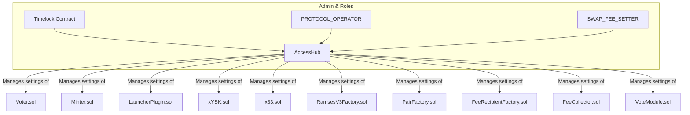

# AccessHub.sol: The Central Nervous System

## Core Purpose

The `AccessHub.sol` contract is the administrative heart of the entire protocol.
It functions as both a central registry for all other smart contracts and as the primary access control layer for managing sensitive, protocol-wide settings.
Think of it as the main switchboard or control panel for the developers and the DAO.

---

## Step-by-Step Workflows

The `AccessHub` is not typically used by end-users.
Its workflows are administrative, performed by the team or the DAO.

### Example: Setting Swap Fees

1.  **Authorization**: An address that has been granted the `SWAP_FEE_SETTER` role needs to update the trading fees for several liquidity pools.

2.  **Call `AccessHub`**: This address calls the `setSwapFees()` function on the `AccessHub` contract.
    - **Parameters**: They provide an array of pool addresses, an array of the new fee values, and an array of booleans indicating whether each pool is a concentrated liquidity (CL) or legacy pool.

3.  **`AccessHub` Acts as a Proxy**: The `AccessHub` receives this call, verifies the sender's role, and then iterates through the provided arrays.
    - For each pool, it checks if it's a CL or legacy pool.
    - It then calls the appropriate fee-setting function on the correct factory contract (`RamsesV3Factory.sol` for CL pools or `PairFactory.sol` for legacy pools).

### Example: Killing a Gauge

1.  **Authorization**: An address with the `PROTOCOL_OPERATOR` role decides a gauge is no longer needed.

2.  **Call `AccessHub`**: They call the `killGauge()` function on the `AccessHub`, providing the address of the pool whose gauge needs to be killed.

3.  **`AccessHub` Orchestrates a Sequence**: The `AccessHub` executes a series of actions in the correct order:
    - It first calls the `FeeCollector` to ensure any pending protocol fees from that pool are collected.
    - It then calls the `killGauge()` function on the `Voter` contract to stop emissions.
    - Finally, it calls the appropriate factory to update the fee structure for the now-gaueless pool.

---

## Contract Interactions

The `AccessHub` is the master controller. It sits at the top of the hierarchy and can modify the state of almost every other contract in the system.

