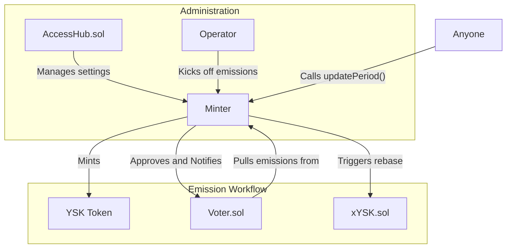

# Minter.sol

## Core Purpose

The `Minter.sol` is the entity responsible for minting the `YSK` token.
It functions as the protocol's central bank, controlling the supply of `YSK` by minting a predetermined amount of new tokens each week.
These new tokens are the "emissions" that fuel the entire reward system.

## Key Features

- **Scheduled Emissions**: Mints a new supply of `YSK` tokens precisely once per epoch (every 7 days).
- **Dynamic Inflation Control**: The rate of inflation is not fixed. It is managed by an `emissionsMultiplier` that can be adjusted by governance, allowing the DAO to respond to market conditions.
- **Hard Supply Cap**: The contract enforces a `MAX_SUPPLY` for `YSK`, ensuring that the token cannot be inflated indefinitely.
- **Controlled Start**: A two-step `kickoff` and `startEmissions` process ensures that the protocol can be fully configured before the token inflation begins.
- **Direct Voter Integration**: It sends the newly minted `YSK` tokens directly to the `Voter.sol` contract to be distributed as rewards.
- **Rebase Trigger**: It plays a crucial role in the `xYSK` auto-compounding mechanism by calling the `rebase()` function on the `xYSK` contract after minting new tokens.

---

## Step-by-Step Workflows

### The Weekly Emission Cycle

This is the primary, automated workflow of the `Minter`.

1.  **Epoch Rollover**: A new 7-day epoch begins (on Thursday at 00:00 UTC).

2.  **`updatePeriod`**: Anyone can call the `updatePeriod()` function.
    This function is permissionless and is typically called by another core contract (like `Voter.sol`) to ensure the emissions for the new epoch are available before rewards are distributed.

3.  **Calculate New Emissions**: Inside `updatePeriod()`, the `Minter` first checks if the epoch has indeed rolled over.
    If it has, it calculates the amount of `YSK` to mint for the week using the `calculateWeeklyEmissions()`.
    - This function takes the base `weeklyEmissions` rate and adjusts it using the `emissionsMultiplier`.
    - It then checks that minting this amount will not cause the total supply of `YSK` to exceed the `MAX_SUPPLY`. If it would, it reduces the amount to mint only what is left to reach the cap.

4.  **Mint, Approve, and Notify**:
    - **Mint**: The `Minter` calls the `mint()` function on the `YSK` token contract, creating the new tokens and holding them in its own address.
    - **Approve**: It then approves the `Voter.sol` contract to withdraw the full amount of the newly minted tokens.
    - **Notify Voter**: It calls `notifyRewardAmount()` on `Voter.sol`, which signals to the `Voter` that a new batch of rewards is ready for distribution.
    - **Trigger Rebase**: Finally, it calls the `rebase()` function on the `xYSK.sol` contract, which is essential for the `xYSK` token's value to properly accrue.

### Initial Setup

This is the one-time process for starting the Minter.

1.  **`kickoff()`**: The protocol's `operator` calls this function to set the initial state of the `Minter`, including the addresses of the `YSK`, `xYSK`, and `Voter` contracts, and the starting values for `weeklyEmissions` and `emissionsMultiplier`. This step also mints the `INITIAL_SUPPLY` of `YSK`.

2.  **`startEmissions()`**: After everything is configured, the `operator` calls this function to officially begin the weekly emission schedule.

---

## Contract Interactions

The `Minter` is a simple but powerful contract that acts as the source of inflation for the entire ecosystem.

