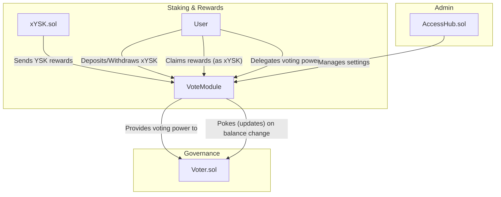

# VoteModule.sol: The Engine of Voting Power

## Core Purpose

The `VoteModule.sol` contract is a foundational component of the governance system.
Its primary responsibility is to manage the staking of `xYSK` tokens.
By staking their `xYSK` in this contract, users _acquire voting power_, which they can then use in the `Voter.sol` contract to influence protocol emissions.
The contract also handles the distribution of rewards to these stakers.

## Key Features

- **Staking**: Allows users to deposit and withdraw `xYSK` tokens to participate in governance.
- **Voting Power**: A user's staked balance in this contract directly represents their voting power in the protocol.
- **Reward Distribution**: Receives `YSK` and distributes them to stakers.
- **Delegation**: Enables users to delegate their voting power to another address, allowing for more flexible governance participation.
- **Cooldown Period**: Enforces a waiting period for withdrawals after a reward event to ensure system stability.
- **Voter Integration**: Automatically notifies the `Voter.sol` contract of any changes to a user's voting power.

---

## Step-by-Step Workflows

### Staking, Rewards, and Unstaking

This is the primary workflow for users interacting with the `VoteModule`.

1.  **Deposit `xYSK`**: A user calls the `deposit()` function to stake their `xYSK`.
    - **Action**: The contract transfers the `xYSK` tokens from the user to itself and updates the user's `balanceOf`.
    - **Crucial Interaction**: It then immediately calls the `poke()` function on the `Voter.sol` contract, signaling that this user's voting power has changed.

2.  **Receive Rewards**: The `xYSK.sol` contract, which auto-compounds rewards, periodically sends a portion of the underlying `YSK` tokens to the `VoteModule` by calling `notifyRewardAmount()`.
    - **Action**: This initiates a new reward distribution cycle and activates a `cooldown` period, during which withdrawals are temporarily paused.

3.  **Accrue and Claim Rewards**: Stakers earn a share of these `YSK` rewards over time.
    - A user can call `getReward()` at any time to claim their accrued rewards. The `VoteModule` handles converting the `YSK` back to `xYSK` and sends it to the user.

4.  **Withdraw `xYSK`**: A user calls `withdraw()` to unstake their `xYSK`.
    - **Restriction**: This is not allowed during the `cooldown` period unless the user's address is specifically exempted.
    - **Action**: The contract returns the staked `xYSK` to the user.
    - **Crucial Interaction**: Just like with a deposit, it calls `poke()` on the `Voter.sol` contract to update the user's voting power (which will now be lower).

### Delegation

This feature allows for more flexible governance.

1.  **Delegate Power**: A user (the `delegator`) calls the `delegate()` function and specifies another address (the `delegatee`).
    - **Action**: The contract records this delegation.

2.  **Vote on Behalf**: The `delegatee` is now authorized to call the `vote()` function in `Voter.sol` on behalf of the `delegator`, using the `delegator`'s voting power.

3.  **Set Admin**: Users can also set an `admin` for their account, which is a higher level of delegation that also includes the power to vote.

---

## Contract Interactions

The `VoteModule.sol` acts as the bridge between holding the `xYSK` token and exercising power in the `Voter.sol` contract.

