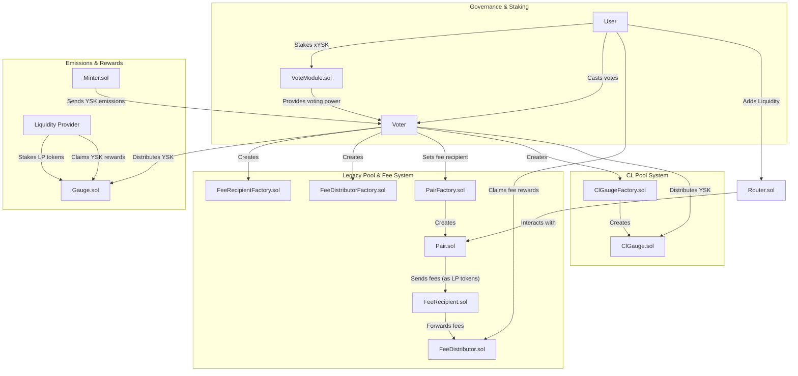

# Voter.sol

## Core Purpose

The `Voter.sol` contract is the central nervous system of the DEX's governance and rewards system.
Its primary role is to allow users who hold voting power to direct the flow of newly minted `YSK` tokens to the liquidity pools they want to support.
This mechanism is the cornerstone of the protocol's tokenomics, designed to incentivize long-term liquidity and community participation.

## Key Features

- **Decentralized Governance**: Allows users to vote on where protocol emissions should be directed.
- **Reward Distribution**: Manages the distribution of `YSK` emissions to liquidity providers.
- **Gauge Management**: Handles the creation, lifecycle (killing/reviving), and management of reward gauges for both legacy and concentrated liquidity (CL) pools.
- **Dynamic Voting Power**: Integrates with the `VoteModule.sol` to use a user's real-time voting power.
- **Fee-to-Voters Mechanism**: Orchestrates the system that redirects trading fees from legacy pools to the voters.

## X ratio

This one determines how the weekly YSK emissions are split between the liquid YSK token and the staked xYSK token when they are distributed to the liquidity pool gauges.

How it Works

When it's time to distribute the weekly emissions to a gauge, the Voter contract uses the following logic:

1.  It calculates the total claimable emissions for the gauge.
2.  It uses the xRatio to determine how much of those emissions should be paid out in xYSK. The formula is:

$$
amount_of_xYSK = (total_emissions * xRatio) / 1_000_000
$$

3.  The remaining amount is paid out in YSK.

The 1_000_000 in the formula represents 100%.

- `xRatio` = 1,000,000 (100%): All emissions are distributed as xYSK. This is the default setting.
- `xRatio` = 500,000 (50%): The emissions are split 50/50. Half are paid out as xYSK, and the other half as YSK.
- `xRatio` = 0 (0%): All emissions are distributed as YSK.

Purpose of xRatio

The xRatio gives the protocol's governance a powerful tool to influence the tokenomics of the system. By
adjusting this ratio, governance can:

- Incentivize Staking: By increasing the xRatio, governance can encourage users to hold the staked xYSK token,
  which can lead to more price stability and long-term alignment with the protocol.
- Increase Liquidity: By decreasing the xRatio, governance can provide more liquid YSK rewards, which might be
  more attractive to short-term liquidity providers.

---

## Workflows

### The Voting Process

This is the core governance process where users influence the protocol.

1.  **Acquire Voting Power**: A user first stakes their `xYSK` tokens in the `VoteModule.sol` contract to obtain voting power.

2.  **Cast Votes**: The user calls the `vote()` function in `Voter.sol`.
    - **Parameters**: They provide a list of pool addresses they want to vote for and the corresponding weights for each vote.
    - **Action**: The `Voter.sol` contract records these votes. It's important to note that these votes apply to the _next_ epoch (the next 7-day period), not the current one.

3.  **Update Votes (Optional)**:
    - If a user's voting power changes in the `VoteModule`, their existing votes might not reflect their new influence.
    - The `poke()` function can be called to reset their previous votes and recast them with their updated voting power, ensuring the vote distribution remains accurate.

### The Emission Distribution Process

This process describes how the rewards flow from the minter to the liquidity providers.

1.  **Receive Emissions**: The `Minter.sol` contract, which is responsible for minting new `YSK` tokens, calls the `notifyRewardAmount()` function on `Voter.sol` to send the newly minted tokens for the current epoch.

2.  **Calculate Gauge Rewards**: At the end of an epoch, the `Voter.sol` contract has a record of all the votes cast for each gauge. It calculates the share of the total emissions that each gauge should receive based on its proportion of the total votes.

3.  **Distribute to Gauges**:
    - Anyone can call the `distribute()` function for a specific gauge.
    - **Action**: The `Voter.sol` contract sends the calculated amount of `YSK` rewards to the `Gauge.sol` contract for that pool.

4.  **LPs Claim Rewards**: Liquidity providers who have staked their LP tokens in the `Gauge.sol` contract can then claim their share of the `YSK` rewards.

### The Legacy Gauge and Fee-to-Voter Creation Process

This workflow is a great example of how `Voter.sol` acts as a central orchestrator.

1.  **Initiate Gauge Creation**: A user calls the `createGauge()` function for a legacy liquidity pool.

2.  **Voter.sol Takes Over**: The `Voter.sol` contract performs a series of actions:
    - **Creates a `FeeRecipient`**: It calls the `FeeRecipientFactory.sol` to create a new, dedicated `FeeRecipient` contract for the pool.
    - **Creates a `FeeDistributor`**: It calls the `FeeDistributorFactory.sol` to create a new `FeeDistributor` contract.
    - **Links Fee Contracts**: It initializes the new `FeeRecipient` with the address of the new `FeeDistributor`.
    - **Sets the Pair's `feeRecipient`**: It calls the `PairFactory.sol` to set the `feeRecipient` on the `Pair.sol` contract to the newly created `FeeRecipient`.
      This is the crucial step that diverts the trading fees.
    - **Creates the `Gauge`**: It calls the `GaugeFactory.sol` to create the actual `Gauge.sol` contract for the pool.

3.  **System is Live**: At the end of this process, two parallel reward systems are active for the pool:
    - **For LPs**: They can stake their LP tokens in the `Gauge.sol` to earn `YSK` emissions.
    - **For Voters**: The trading fees from the `Pair.sol` are sent to the `FeeDistributor.sol` (via the `FeeRecipient.sol`),
      where voters who voted for this gauge can claim them.

---

## Contract Interactions

The `Voter.sol` contract sits at the center of the protocol, interacting with many other contracts to perform its functions.

