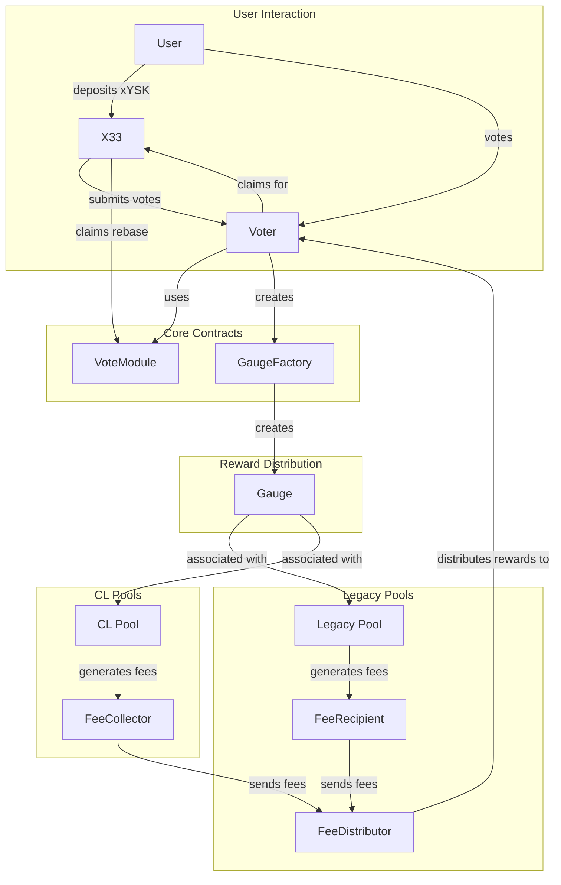

```mermaid
graph TD
    subgraph User Interaction
        User -- deposits xYSK --> X33
        User -- votes --> Voter
    end

    subgraph Core Contracts
        Voter -- uses --> VoteModule
        Voter -- creates --> GaugeFactory
        Voter -- claims for --> X33
        X33 -- submits votes --> Voter
        X33 -- claims rebase --> VoteModule
    end

    subgraph Legacy Pools
        LegacyPool[Legacy Pool] -- generates fees --> FeeRecipient
        FeeRecipient -- sends fees --> FeeDistributor
    end

    subgraph CL Pools
        CLPool[CL Pool] -- generates fees --> FeeCollector
        FeeCollector -- sends fees --> FeeDistributor
    end

    subgraph Reward Distribution
        GaugeFactory -- creates --> Gauge
        Gauge -- associated with --> LegacyPool
        Gauge -- associated with --> CLPool
        FeeDistributor -- distributes rewards to --> Voter
    end
```
